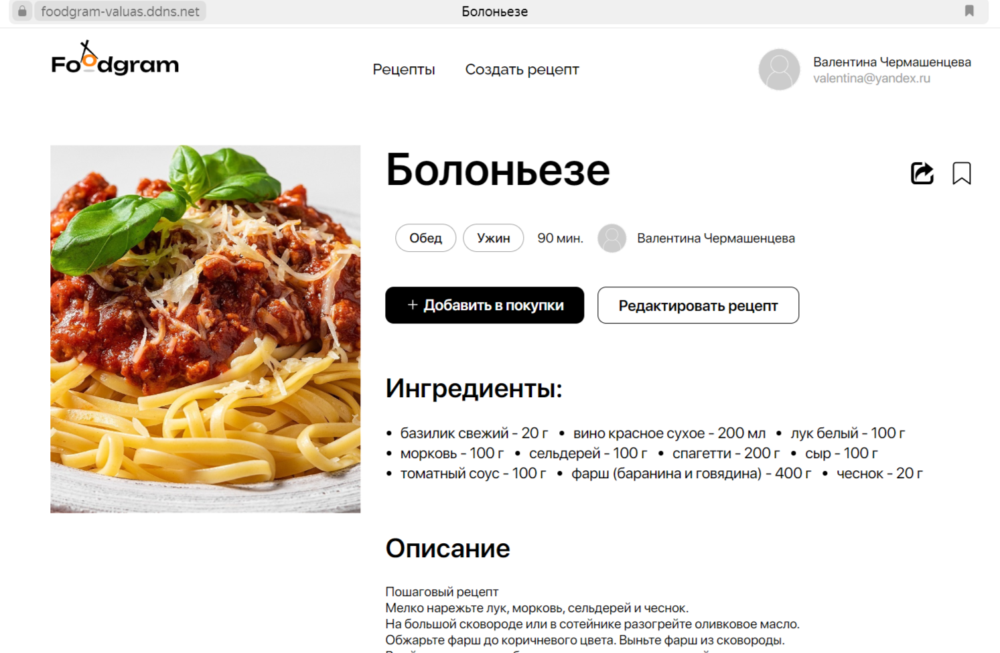

## FOODGRAM

Проект предствляет собой социальную сеть в которой пользователя могут:
  - делиться рецептами блюд
  - подписываться на авторов рецептов
  - получать список продуктов необходимых для рецепта
И еще много другое, что вы можете увидеть в рабочей версии




http://84.252.139.254:7000

---
Бэкенд проекта разработан с помощью: <br><br> <br>

Фреймворки: <br><br>


База данных:<br><br>


Серверная часть: <br><br>


---
Установка на локальном компьютере

1. Клонируйте репозиторий:

```
git clone git@github.com:hqcamp/test-backend-3.git
```

2. Установите и активируйте виртуальное окружение:
```
python -m venv venv
source venv/Scripts/activate  - для Windows
source venv/bin/activate - для Linux
```
3. Установите зависимости:
```
python -m pip install --upgrade pip
pip install -r requirements.txt
```

4. Перейдите в папку product и выполните миграции:
```
cd product
python manage.py migrate
```
5. Создайте суперпользователя:
```
python manage.py createsuperuser
```
6.Запустите проект:
```
python manage.py runserver
```
